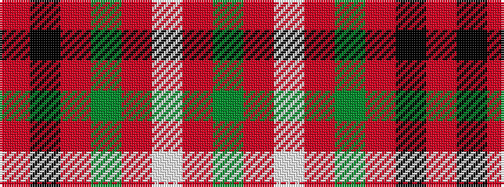

GRWRGRKR

It is a 8 stripe tartan.

<figure class="pat-woven">

<figcaption>idealised sample</figcaption>
</figure>

## Colour Sequence



## Tartans with this colour sequence

| Tartans |
|---------------|
| [MacCall/McCall](/setts/s8/r3k2r3g12r3w1r1g1~x4/)|
||
