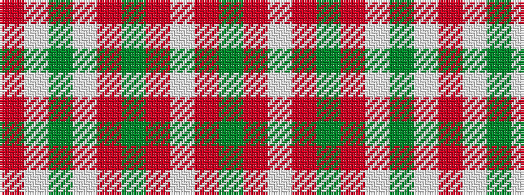

GRWRGRWGWR

It is a 10 stripe tartan.

<figure class="pat-woven">

<figcaption>idealised sample</figcaption>
</figure>

## Colour Sequence



## Tartans with this colour sequence

| Tartans |
|---------------|
| [Glenfinnan (Fashion)](/setts/s10/r5w2g3w2r10g10r2w1r2dg1~x4/)|
||
