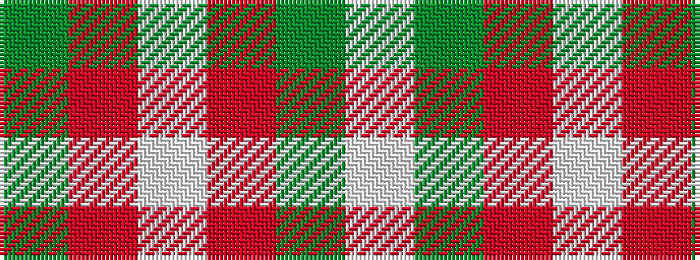

GRWRGW

It is a 6 stripe tartan.

<figure class="pat-woven">

<figcaption>idealised sample</figcaption>
</figure>

## Colour Sequence



## Tartans with this colour sequence

| Tartans |
|---------------|
| [Omani Regiment 2nd Pipe Sqn.](/setts/s6/g23r23w9r23g23w9~x2/)|
||
