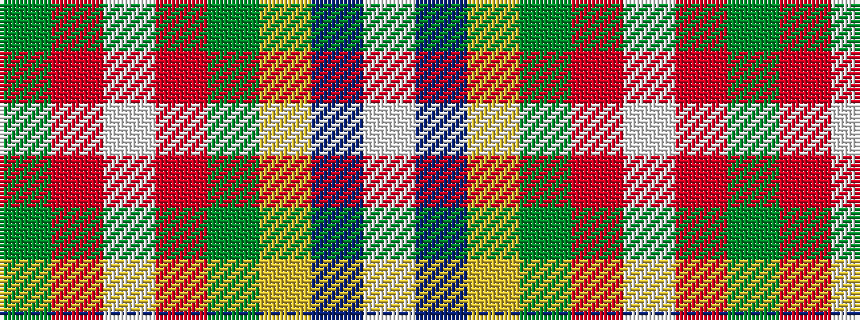

GRWRGYBW

It is a 8 stripe tartan.

<figure class="pat-woven">

<figcaption>idealised sample</figcaption>
</figure>

## Colour Sequence



## Tartans with this colour sequence

| Tartans |
|---------------|
| [Greeven, Wolfgang H (Personal)](/variants/s8/dg62r5w1r4g5lo4dt4w2~x2/)|
||
