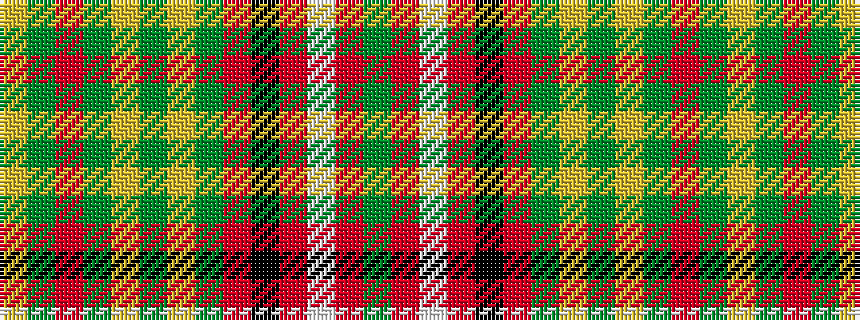

GRWRKRGYGYGRGY

It is a 14 stripe tartan.

<figure class="pat-woven">

<figcaption>idealised sample</figcaption>
</figure>

## Colour Sequence



## Tartans with this colour sequence

| Tartans |
|---------------|
| [Leask](/setts/s14/g4r2w1r2k1r24g12ly2g3ly2g12r2g3ly4~x2/)|
||
| [Leask](/setts/s14/g2r2w1r2k1r24g12ly2g3ly2g12r2g3ly2~x2/)|
||
