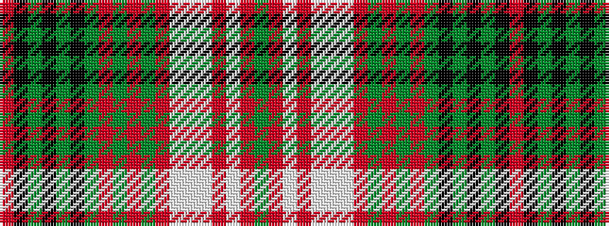

GRWRWWWRGRGRGKGKGKR

It is a 19 stripe tartan.

<figure class="pat-woven">

<figcaption>idealised sample</figcaption>
</figure>

## Colour Sequence



## Tartans with this colour sequence

| Tartans |
|---------------|
| [Drymen](/setts/s19/dg8o3lb3o3w28lb4w8o12dg3o3dg3o3dg8k3dg3k3dg3k12r4/)|
||
