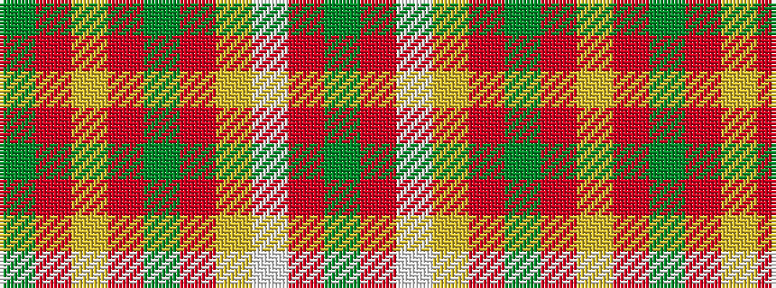

GRWYRGRYRG

It is a 10 stripe tartan.

<figure class="pat-woven">

<figcaption>idealised sample</figcaption>
</figure>

## Colour Sequence



## Tartans with this colour sequence

| Tartans |
|---------------|
| [Glendronach Distillery](/setts/s10/dg22o2lb1lo3o1dg6o22lo3o1dg10~x4/)|
||
