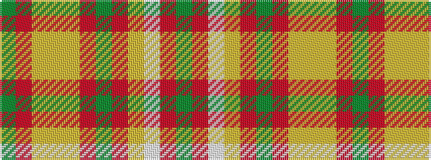

GRWYRGRYYYRG

It is a 12 stripe tartan.

<figure class="pat-woven">

<figcaption>idealised sample</figcaption>
</figure>

## Colour Sequence



## Tartans with this colour sequence

| Tartans |
|---------------|
| [Glendronach Corporate Tartan](/variants/s12/dy21m2w1ly3m2dy5m21ly1ly1ly1m1dy8~x2/)|
||
