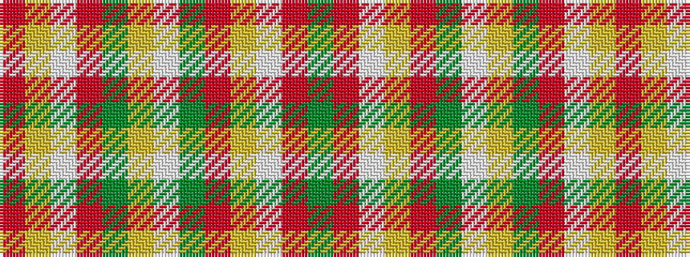

GRWYRGWYGRWYR

It is a 13 stripe tartan.

<figure class="pat-woven">

<figcaption>idealised sample</figcaption>
</figure>

## Colour Sequence



## Tartans with this colour sequence

| Tartans |
|---------------|
| [Hogan (Name)](/variants/s13/dg49r3w2ly1o3dg19w2ly1dg5r3w2ly1o3~x2/)|
||
