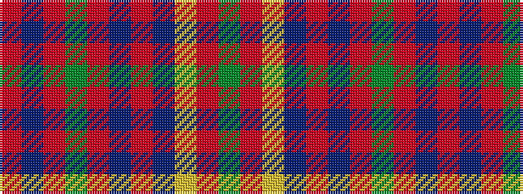

GRYBRBRGRBR

It is a 11 stripe tartan.

<figure class="pat-woven">

<figcaption>idealised sample</figcaption>
</figure>

## Colour Sequence



## Tartans with this colour sequence

| Tartans |
|---------------|
| [MacPherson Of Cluny](/setts/s11/r3dp1r1dg21r3dp18r35dp1ly1r4dg1/)|
||
| [MacPherson Of Cluny](/tartans/r5n2r2dg42r5n36r70n2ly2r7dg2/)|
||
| [MacPherson of Cluny](/setts/s11/r5p2r2g42r5p36r70p2ly2r7g2~x2/)|
||
