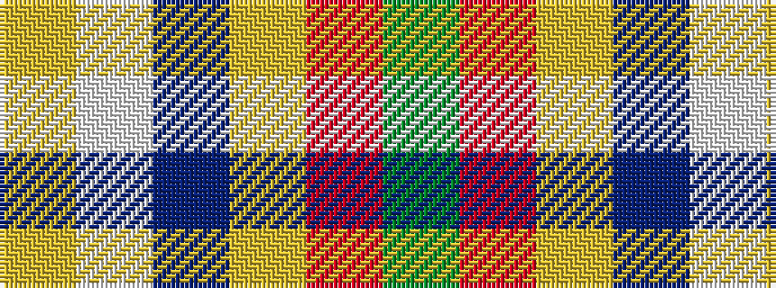

GRYBWY

It is a 6 stripe tartan.

<figure class="pat-woven">

<figcaption>idealised sample</figcaption>
</figure>

## Colour Sequence



## Tartans with this colour sequence

| Tartans |
|---------------|
| [Ravetta, Phil (Fife)](/variants/s6/g20r10ly2db100w1lg10/)|
||
