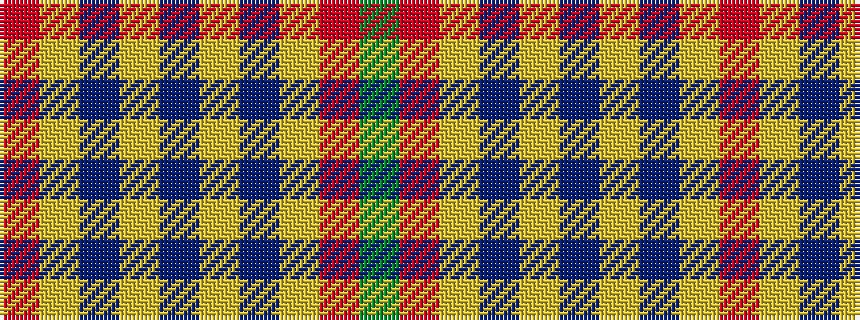

GRYBYBYBYR

It is a 10 stripe tartan.

<figure class="pat-woven">

<figcaption>idealised sample</figcaption>
</figure>

## Colour Sequence



## Tartans with this colour sequence

| Tartans |
|---------------|
| [Unnamed](/variants/s10/r18ly2b6ly2b4ly2b12ly3r4g2~x2/)|
||
