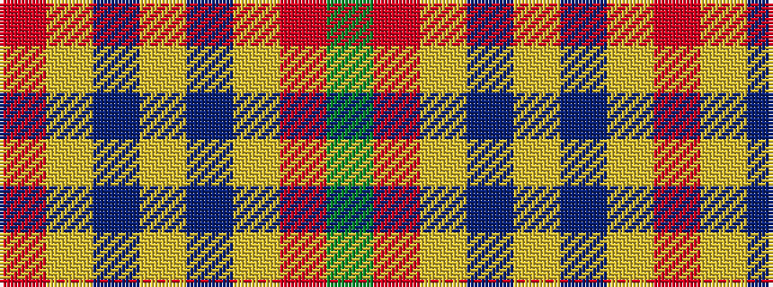

GRYBYBYR

It is a 8 stripe tartan.

<figure class="pat-woven">

<figcaption>idealised sample</figcaption>
</figure>

## Colour Sequence



## Tartans with this colour sequence

| Tartans |
|---------------|
| [Unidentified from Winnipeg](/variants/s8/oi24lo8dr2lo8dr2lo8o15g2~x2/)|
||
