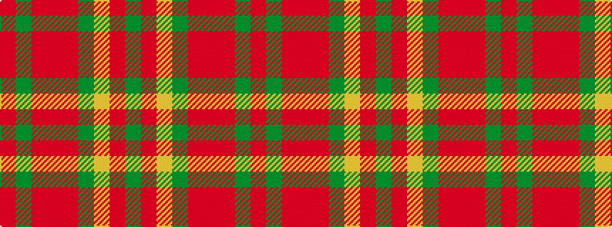

GRYGRRRGR

It is a 9 stripe tartan.

<figure class="pat-woven">

<figcaption>idealised sample</figcaption>
</figure>

## Colour Sequence



## Tartans with this colour sequence

| Tartans |
|---------------|
| [Henry, W. A.](/variants/s9/dy16r16lr3dg16o2r1o2dy6r2~x4/)|
||
