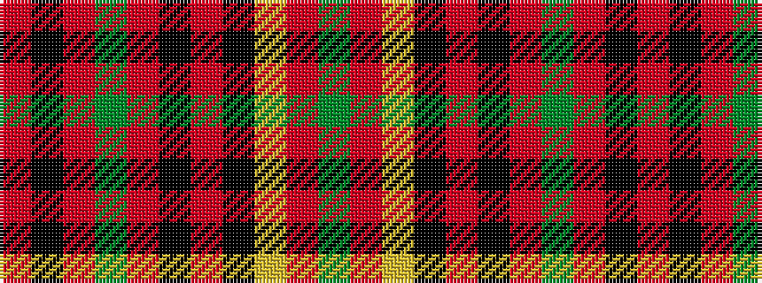

GRYKRKRGRKR

It is a 11 stripe tartan.

<figure class="pat-woven">

<figcaption>idealised sample</figcaption>
</figure>

## Colour Sequence



## Tartans with this colour sequence

| Tartans |
|---------------|
| [MacPherson of Cluny](/variants/s11/r5k2r2g42r5k36r70k2ly2r7g2/)|
||
