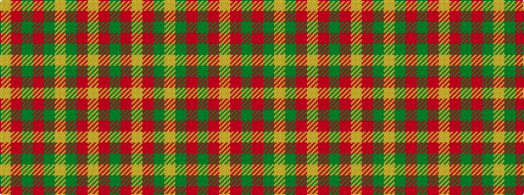

GRYRGYGRGRY

It is a 11 stripe tartan.

<figure class="pat-woven">

<figcaption>idealised sample</figcaption>
</figure>

## Colour Sequence



## Tartans with this colour sequence

| Tartans |
|---------------|
| [Strathearn (Royal)](/variants/s11/g1r1ly8r6g1ly1g1r6g6r1ly1~x4/)|
||
