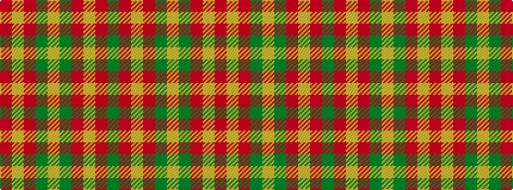

GRYRGYGRYR

It is a 10 stripe tartan.

<figure class="pat-woven">

<figcaption>idealised sample</figcaption>
</figure>

## Colour Sequence



## Tartans with this colour sequence

| Tartans |
|---------------|
| [Unidentified Lindley #5](/variants/s10/dy1r1lo7r7dy1lo1dy1r7lo7r1~x4/)|
||
