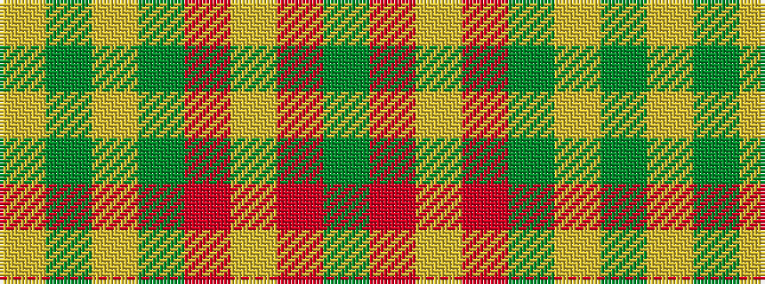

GRYRGYGY

It is a 8 stripe tartan.

<figure class="pat-woven">

<figcaption>idealised sample</figcaption>
</figure>

## Colour Sequence



## Tartans with this colour sequence

| Tartans |
|---------------|
| [Unidentified #57](/variants/s8/dg20r8lr2r8dg5ly8dg2ly8~x2/)|
||
