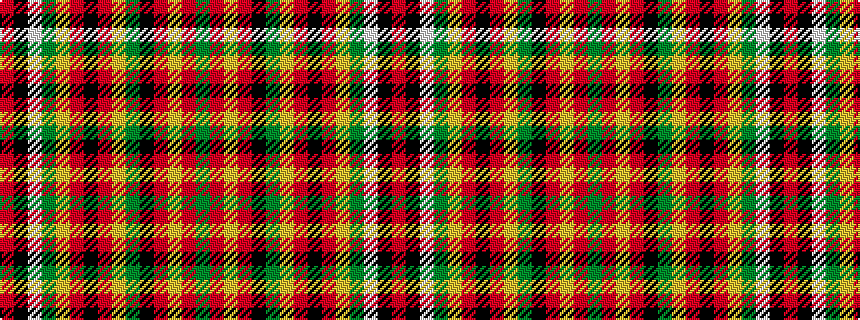

GRYRKGYRKRYGWKR

It is a 15 stripe tartan.

<figure class="pat-woven">

<figcaption>idealised sample</figcaption>
</figure>

## Colour Sequence



## Tartans with this colour sequence

| Tartans |
|---------------|
| [MacPherson (Crubin Plaid)](/variants/s15/r160k2w1dg36ly9r4k1r4ly9y36k9r9ly9r4y3~x2/)|
||
