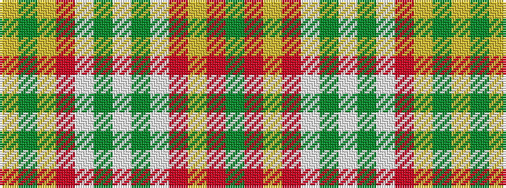

GRYRWGWGWRYGY

It is a 13 stripe tartan.

<figure class="pat-woven">

<figcaption>idealised sample</figcaption>
</figure>

## Colour Sequence



## Tartans with this colour sequence

| Tartans |
|---------------|
| [St. John New Brunswick (District)](/setts/s13/g1r2lg12r15w15g3w1g3w15r15lg3dy12lg1~x2/)|
||
