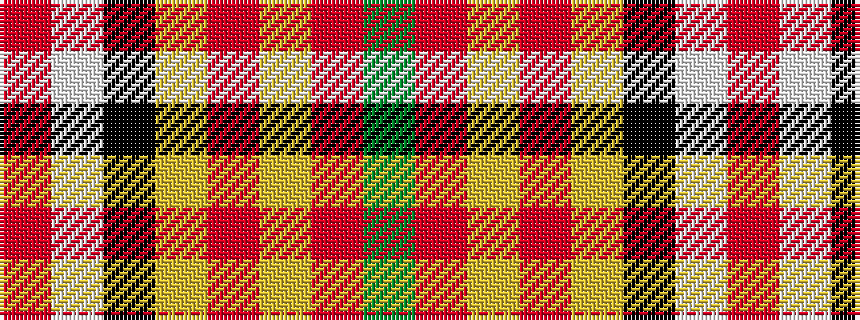

GRYRYKWR

It is a 8 stripe tartan.

<figure class="pat-woven">

<figcaption>idealised sample</figcaption>
</figure>

## Colour Sequence



## Tartans with this colour sequence

| Tartans |
|---------------|
| [Hackston or Halkerston Family Tartan Tartan Number: 907. Earliest known date: 1987 Taken from a portrait (c. 1746) Red pivot reduced by half for display. Should read R112. See products available Copyright © Blair Urquhart, Comrie, 2015](/setts/s8/r28w2k12ly3r12ly3r12g3~x2/)|
||
| [Hackston, or Halkerston](/setts/s8/r56w2k12ly3r12ly3r12g3~x2/)|
||
