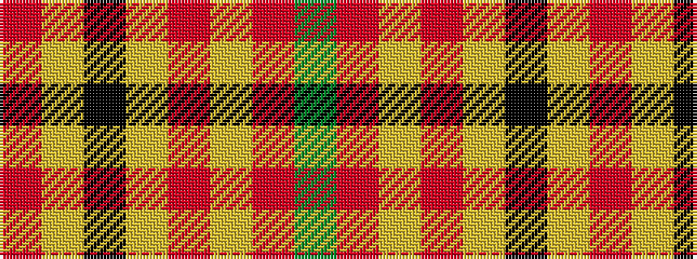

GRYRYKYR

It is a 8 stripe tartan.

<figure class="pat-woven">

<figcaption>idealised sample</figcaption>
</figure>

## Colour Sequence



## Tartans with this colour sequence

| Tartans |
|---------------|
| [Hackston (Green stripe) (Portrait)](/setts/s8/r51lr2k11lo3r11lo3r11g3~x2/)|
||
