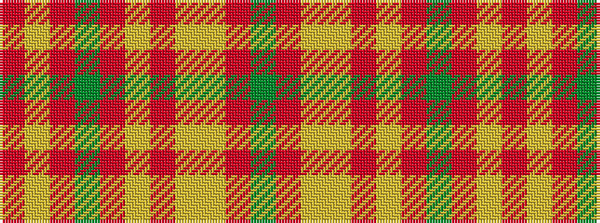

GRYYRYRGRYR

It is a 11 stripe tartan.

<figure class="pat-woven">

<figcaption>idealised sample</figcaption>
</figure>

## Colour Sequence



## Tartans with this colour sequence

| Tartans |
|---------------|
| [MacPherson of Cluny](/setts/s11/r5ly2r2g42r5ly36r70ly2ly2r7g2/)|
||
