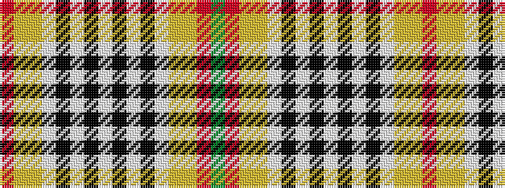

GRYYWKWKWKWKWYYR

It is a 16 stripe tartan.

<figure class="pat-woven">

<figcaption>idealised sample</figcaption>
</figure>

## Colour Sequence



## Tartans with this colour sequence

| Tartans |
|---------------|
| [Somerset](/variants/s16/o8lg7lr5lb2k2lb2k2lb2k2lb2k2lb2lr5lg7o8y8~x4/)|
||
