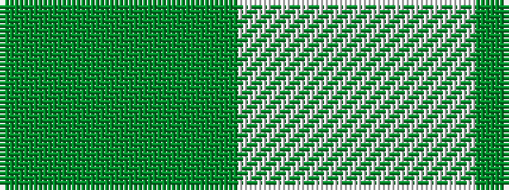

GW

It is a 2 stripe tartan.

<figure class="pat-woven">

<figcaption>idealised sample</figcaption>
</figure>

## Colour Sequence



## Tartans with this colour sequence

| Tartans |
|---------------|
| [Shepherd Brown & White (Fashion?)](/setts/s2/dy1lb1~x6/)|
||
