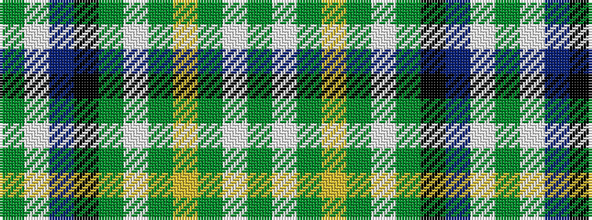

GWBKGWGYGWG

It is a 11 stripe tartan.

<figure class="pat-woven">

<figcaption>idealised sample</figcaption>
</figure>

## Colour Sequence



## Tartans with this colour sequence

| Tartans |
|---------------|
| [MacKellar Dress](/setts/s11/dy27w2dy3ly4dy3w2dy5k13t2w26dg3~x2/)|
||
| [MacKellar Dress Clan Tartan Tartan Number: 926. Earliest known date: 1976 As worn by Kenneth? - D.C.S. See products available Copyright © Blair Urquhart, Comrie, 2015](/setts/s11/dy27w2dy3ly4dy3w2dy5k13t2w26g3~x2/)|
||
