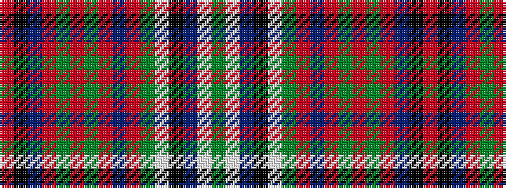

GWBKWGRBRGRGRBKR

It is a 16 stripe tartan.

<figure class="pat-woven">

<figcaption>idealised sample</figcaption>
</figure>

## Colour Sequence



## Tartans with this colour sequence

| Tartans |
|---------------|
| [Stuart/Stewart of Appin (Dress Hunting Stewart)](/setts/s16/r3k2t2r2dg20r3dg2r2db7r2dg2w23k2t2w2dg2~x2/)|
||
