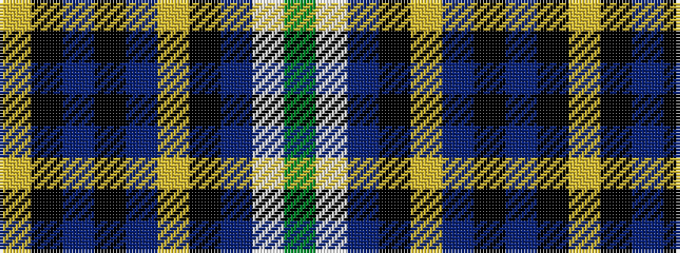

GWBKYBKBKY

It is a 10 stripe tartan.

<figure class="pat-woven">

<figcaption>idealised sample</figcaption>
</figure>

## Colour Sequence



## Tartans with this colour sequence

| Tartans |
|---------------|
| [Haileybury](/variants/s10/ly4k30dr30k2dr2ly2k2dr5w5g2~x2/)|
||
