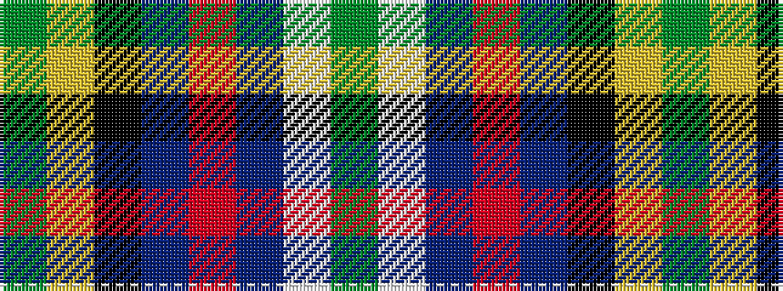

GWBRBKYG

It is a 8 stripe tartan.

<figure class="pat-woven">

<figcaption>idealised sample</figcaption>
</figure>

## Colour Sequence



## Tartans with this colour sequence

| Tartans |
|---------------|
| [Mull Millenium Tartan](/setts/s8/g91ly3k28n18r12dt18w2g12/)|
||
| [Mull Millennium](/setts/s8/g92ly3k28n18r12db18w2g12/)|
||
