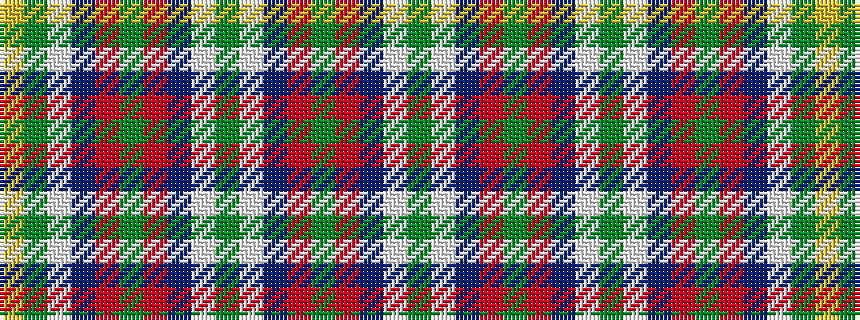

GWBRGRBWGWBRGRBWGY

It is a 18 stripe tartan.

<figure class="pat-woven">

<figcaption>idealised sample</figcaption>
</figure>

## Colour Sequence



## Tartans with this colour sequence

| Tartans |
|---------------|
| [Seattle](/variants/s18/g14lb1db2r1g1r1db2lb1g4lb1db2r1g1r1db2lb1g14lo1~x4/)|
||
