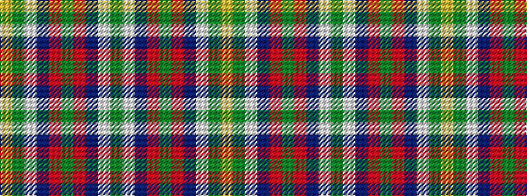

GWBRGRBWGY

It is a 10 stripe tartan.

<figure class="pat-woven">

<figcaption>idealised sample</figcaption>
</figure>

## Colour Sequence



## Tartans with this colour sequence

| Tartans |
|---------------|
| [Seattle](/variants/s10/g14w1db2r1g1r1db2w1g4ly1~x4/)|
||
| [Seattle (District)](/variants/s10/g4lb1db2r1g1r1db2lb1g14lo1~x4/)|
||
