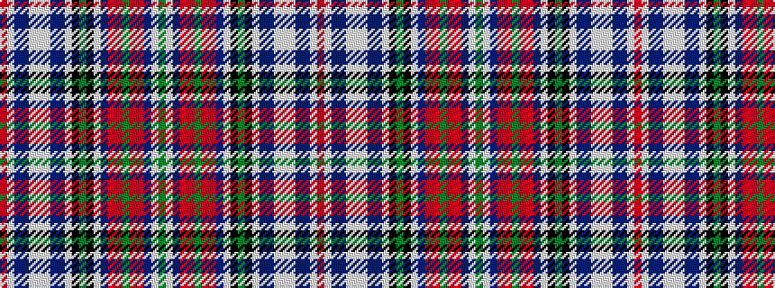

GWBRRGRRBWKGKWBBWWWBBWR

It is a 23 stripe tartan.

<figure class="pat-woven">

<figcaption>idealised sample</figcaption>
</figure>

## Colour Sequence



## Tartans with this colour sequence

This pattern is a design lineage: every tartan below shares one colour order, whatever its owner —
near-identical designs are grouped, the largest lineage first (#112: the pattern is a tartan's
second parent, beside its family or clan).

<table class="sett-table">
<tbody>
<tr><td><a href="/variants/s23/ri32w2db2dbi2lb2w2lb2dbi2db2w2k2g9k2w2dr3ri3r3g2r3ri3dr3w2g6~x2~ri2008029-db0805267-dbi1604274-r1506028/">MacBean, MacVean</a></td></tr>
<tr><td class="sett-swatch"></td></tr>
</tbody>
</table>

