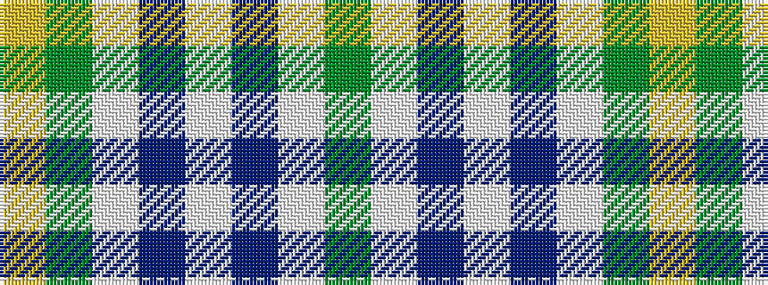

GWBWBWGY

It is a 8 stripe tartan.

<figure class="pat-woven">

<figcaption>idealised sample</figcaption>
</figure>

## Colour Sequence



## Tartans with this colour sequence

| Tartans |
|---------------|
| [Alloway Primary School (Ayr)](/setts/s8/wi30db1w4y10ly18~x2/)|
||
