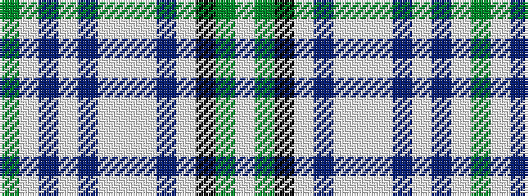

GWBWBWWWBWKGW

It is a 13 stripe tartan.

<figure class="pat-woven">

<figcaption>idealised sample</figcaption>
</figure>

## Colour Sequence



## Tartans with this colour sequence

| Tartans |
|---------------|
| [Willox](/variants/s13/y6lb12db3w1db6lb4w1lb4db6w1k27y5w2~x2/)|
||
| [Willox (Name)](/variants/s13/y6lb12dp3w1dp6lb4w1lb4dp6w1k28y5w1~x2/)|
||
