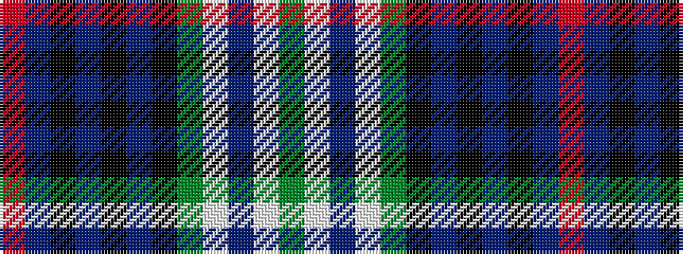

GWBWGKBKBKBR

It is a 12 stripe tartan.

<figure class="pat-woven">

<figcaption>idealised sample</figcaption>
</figure>

## Colour Sequence



## Tartans with this colour sequence

| Tartans |
|---------------|
| [Scotch House (Dalgliesh)](/variants/s12/dg4lb3db3lb3dg12k6db4k3db4k3db12r3~x2/)|
||
