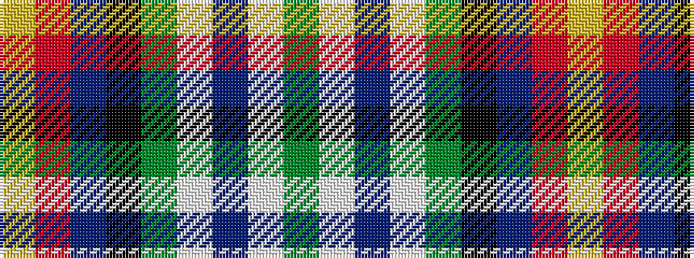

GWBWGKBRY

It is a 9 stripe tartan.

<figure class="pat-woven">

<figcaption>idealised sample</figcaption>
</figure>

## Colour Sequence



## Tartans with this colour sequence

| Tartans |
|---------------|
| [Colorado](/setts/s9/g32lb3dp3lb3g2k20t17r3lo4~x2/)|
||
| [Colorado (District)](/setts/s9/dg32lb3p3lb3dg2k20db17r3ly4~x2/)|
||
