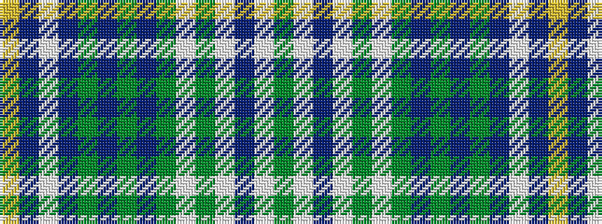

GWBWGWGBGBGBWBY

It is a 15 stripe tartan.

<figure class="pat-woven">

<figcaption>idealised sample</figcaption>
</figure>

## Colour Sequence



## Tartans with this colour sequence

| Tartans |
|---------------|
| [Borderland Dress (Estimated threadcount)](/setts/s15/g2w2db1w30g1w1g5b8g4db1g1db8w1db2ly1~x2/)|
||
