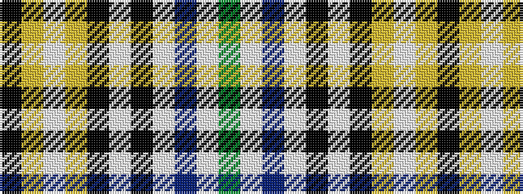

GWBWKWKYWYK

It is a 11 stripe tartan.

<figure class="pat-woven">

<figcaption>idealised sample</figcaption>
</figure>

## Colour Sequence



## Tartans with this colour sequence

| Tartans |
|---------------|
| [Bro-Roazhon](/variants/s11/k28ly1w2ly1k3w17k5w3db2w10g2~x2/)|
||
