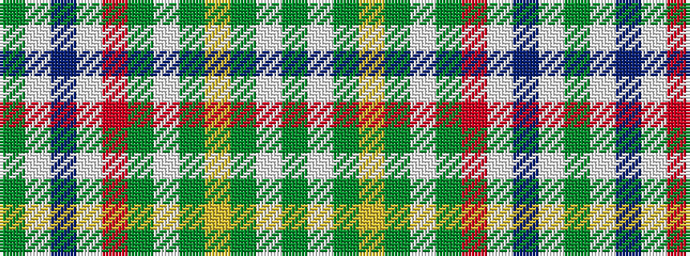

GWBWRGWGYGWG

It is a 12 stripe tartan.

<figure class="pat-woven">

<figcaption>idealised sample</figcaption>
</figure>

## Colour Sequence



## Tartans with this colour sequence

| Tartans |
|---------------|
| [MacLean of Duart Dress #4](/setts/s12/y10lb2dy4ly2dy3w3dy3o18w30n2w4dy2~x2/)|
||
