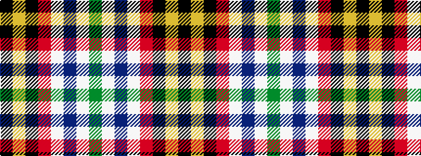

GWBWRKYK

It is a 8 stripe tartan.

<figure class="pat-woven">

<figcaption>idealised sample</figcaption>
</figure>

## Colour Sequence



## Tartans with this colour sequence

| Tartans |
|---------------|
| [Clan MacLeod Societies of Canada](/variants/s8/k4ly2k4r29w29db4w2g4~x2/)|
||
