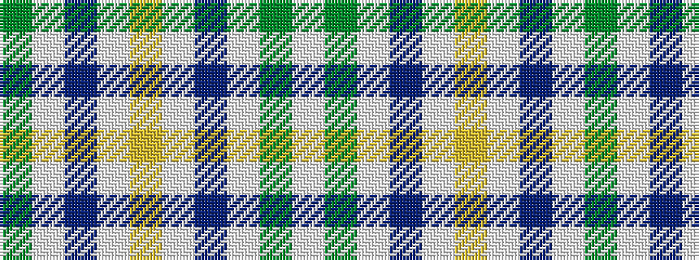

GWBWYWBWGW

It is a 10 stripe tartan.

<figure class="pat-woven">

<figcaption>idealised sample</figcaption>
</figure>

## Colour Sequence



## Tartans with this colour sequence

| Tartans |
|---------------|
| [MacGiboney Clan Tartan Tartan Number: 3839. Earliest known date: 1999 Designed by Greg McGibonney from Fremont, California. The sett shown here was submitted as a woven sample by Greg McGibboney. Colours here are from the woven sample. See products available Copyright © Blair Urquhart, Comrie, 2015](/setts/s10/g5lb5t1lb1ly1lb1t1lb5g5w1~x4/)|
||
| [MacGiboney Dress](/setts/s10/g5lb5t1lb1ly1lb1t1lb5g5w1~x8/)|
||
