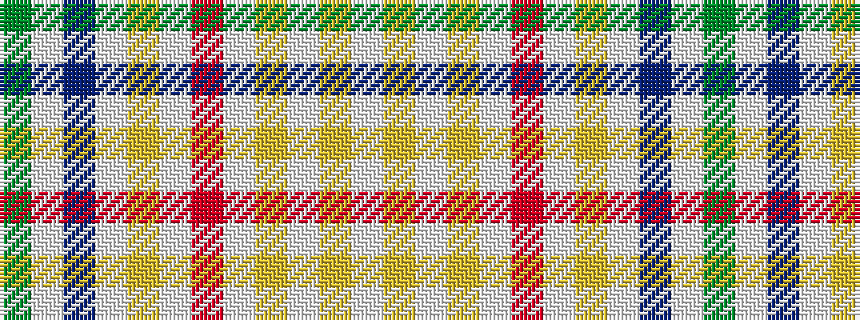

GWBWYWRWYWYW

It is a 12 stripe tartan.

<figure class="pat-woven">

<figcaption>idealised sample</figcaption>
</figure>

## Colour Sequence



## Tartans with this colour sequence

| Tartans |
|---------------|
| [Rainbow (Fort Worth)](/variants/s12/g1w1b1w1lo1w1r1w1lo1w1ly1w1~x10/)|
||
