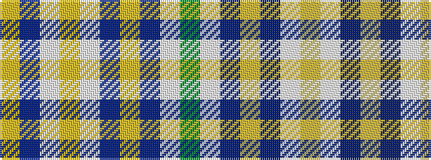

GWBYBWYWBY

It is a 10 stripe tartan.

<figure class="pat-woven">

<figcaption>idealised sample</figcaption>
</figure>

## Colour Sequence



## Tartans with this colour sequence

| Tartans |
|---------------|
| [O'Monaghan (Personal)](/setts/s10/y25w2t4lo7t4w2loi25w2t4lo7~x2/)|
||
