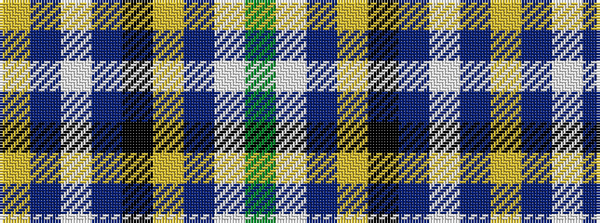

GWBYKBWBY

It is a 9 stripe tartan.

<figure class="pat-woven">

<figcaption>idealised sample</figcaption>
</figure>

## Colour Sequence



## Tartans with this colour sequence

| Tartans |
|---------------|
| [Town of Petawawa](/setts/s9/dg4w1db2lo2k3db3w1dp22lo1~x4/)|
||
