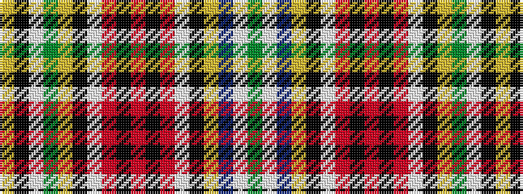

GWBYKWRKRKRWKYGWKY

It is a 18 stripe tartan.

<figure class="pat-woven">

<figcaption>idealised sample</figcaption>
</figure>

## Colour Sequence



## Tartans with this colour sequence

| Tartans |
|---------------|
| [Unidentified #39](/setts/s18/y20w2dp70ly2k13w10r5k1r5k1r5w10k13ly2dy15w22k2ly2~x2/)|
||
