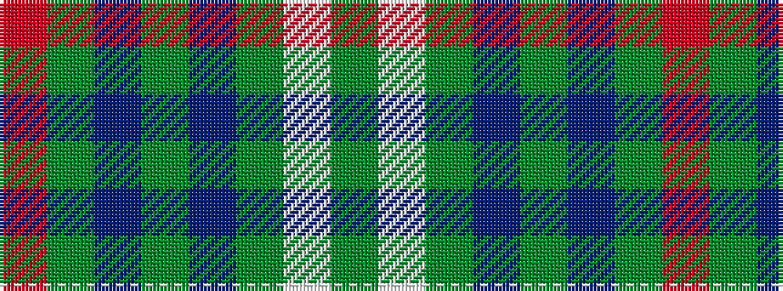

GWGBGBGR

It is a 8 stripe tartan.

<figure class="pat-woven">

<figcaption>idealised sample</figcaption>
</figure>

## Colour Sequence



## Tartans with this colour sequence

| Tartans |
|---------------|
| [Hasegawa (Akasaka) (Personal)](/variants/s8/dg3w5dg3t6dg5t1dg12r1~x2/)|
||
| [Hasegawa (Akasaka) (Personal)](/variants/s8/dg3w5dg3db6dg5db1dg12r1~x2/)|
||
