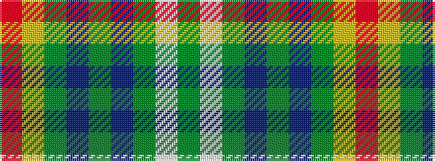

GWGBGBGYR

It is a 9 stripe tartan.

<figure class="pat-woven">

<figcaption>idealised sample</figcaption>
</figure>

## Colour Sequence



## Tartans with this colour sequence

| Tartans |
|---------------|
| [Nova Scotia, dress](/variants/s9/g3w29g3db3g3db6g13ly3r2~x2/)|
||
