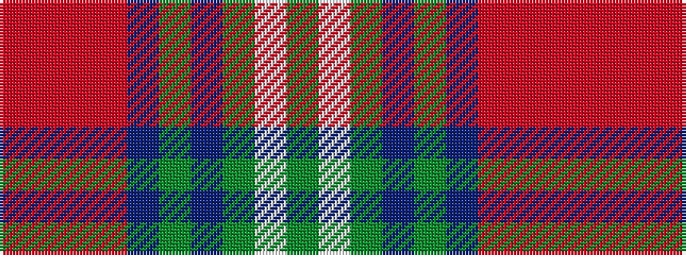

GWGBGBRRRR

It is a 10 stripe tartan.

<figure class="pat-woven">

<figcaption>idealised sample</figcaption>
</figure>

## Colour Sequence



## Tartans with this colour sequence

| Tartans |
|---------------|
| [Bell of Ardbel (Name)](/setts/s10/o7r4o4r25dp1y32dp4y2w2y5~x2/)|
||
