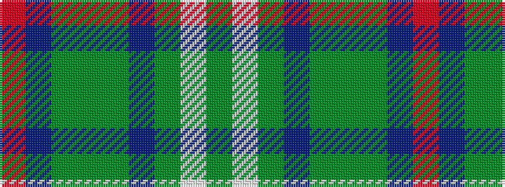

GWGBGGGBR

It is a 9 stripe tartan.

<figure class="pat-woven">

<figcaption>idealised sample</figcaption>
</figure>

## Colour Sequence



## Tartans with this colour sequence

| Tartans |
|---------------|
| [Fraser Gathering Dress (1997)](/setts/s9/r2db12dg2g11dg4db5g2w24g2~x2/)|
||
| [Fraser Gathering, dress](/setts/s9/r2db12dg2gi11dg4db5gi2w24g2~x2/)|
||
