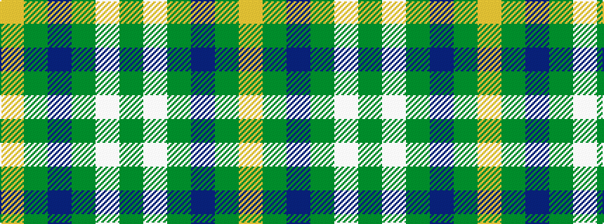

GWGBGY

It is a 6 stripe tartan.

<figure class="pat-woven">

<figcaption>idealised sample</figcaption>
</figure>

## Colour Sequence



## Tartans with this colour sequence

| Tartans |
|---------------|
| [Meath County Crest (Fashion)](/variants/s6/lo21g28db24g72w16g20/)|
||
